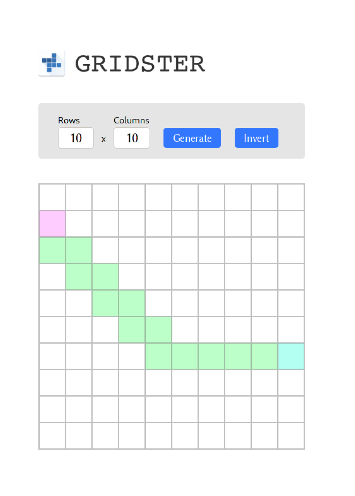

<div style="display: flex; justify-content: center; align-items: center; margin: 6rem 0;">
<a href="http://rusty-grid.kipras.org" style="margin: 2rem 2rem;" >

</a>
</div>

# rusty-grid

[rusty-grid.kipras.org](http://rusty-grid.kipras.org)

## Setup

### Prerequisites

install:

- node: https://nodejs.org/en/download
- rust: https://doc.rust-lang.org/cargo/getting-started/installation.html

and setup:

```sh
npm   install yarn -g
cargo install wasm-pack
```

### Clone & build

```sh
git clone https://github.com/kiprasmel/rusty-grid.git
# or:     git clone git@github.com:kiprasmel/rusty-grid.git

cd rusty-grid/
yarn install

# needs to be rebuilt every time you update rust code
# note - the first time will take a while
cd shortest-path/
wasm-pack build 

cd pkg/
yarn link

cd ../../
yarn link shortest-path

```

### Run

```sh
yarn start
```

## Post mortem

[./POST-MORTEM.md](./POST-MORTEM.md)
